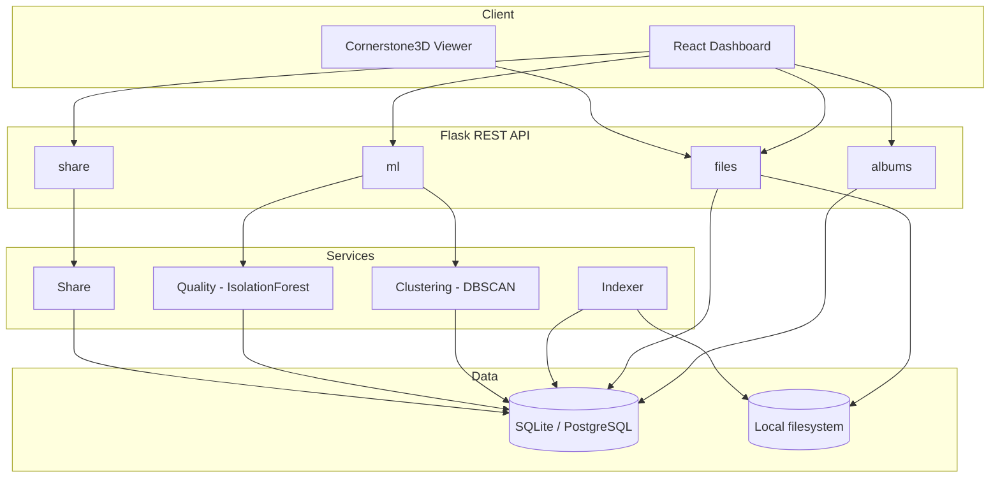

# MedVault

**A smart DICOM medical image research assistant — built solo, from scratch.**

[](https://python.org)
[](https://flask.palletsprojects.com)
[](https://react.dev)
[](https://scikit-learn.org)
[](LICENSE)

---

## The Problem

Medical researchers routinely end up with thousands of loose `.dcm` (DICOM) files dumped in a folder after a study export — no structure, no way to browse them, no way to tell which ones are corrupt, and no easy way to share a subset with a collaborator. Sorting through them by hand doesn't scale.

## What MedVault Does

MedVault turns a messy folder of DICOM files into a searchable, organized, shareable research workspace:

1. **Indexes** every `.dcm` file in a folder, extracting metadata (modality, body part, study date, etc.) without needing to touch pixel data unless it's actually needed.
2. **Suggests albums automatically** using unsupervised ML — clustering files by metadata similarity instead of making you write filter rules by hand.
3. **Flags likely-bad files** — corrupt, blank, or statistical outliers — before you waste time downloading or sharing them, using an anomaly-detection model trained on pixel statistics.
4. **Renders images in the browser** via an embedded DICOM viewer — no desktop software required.
5. **Exports or shares albums** through secure, optionally password-protected, expiring links.

This is a from-scratch, independent build — not a fork. The problem domain grew out of earlier open-source work in this space (see *Background* below), but the schema, API design, and both ML features here are original.

## Key Features

| Feature | What it does |
|---|---|
| Recursive DICOM indexer | Walks a folder tree, parses every `.dcm` file, extracts metadata into a queryable database, logs unreadable files instead of crashing |
| Album management | Group files into named, renameable collections |
| 🧠 Smart auto-albuming (ML) | DBSCAN clustering suggests album groupings from metadata — accept, reject, or rename each one |
| 🧠 Quality anomaly detection (ML) | IsolationForest flags likely-corrupt or outlier images from pixel statistics |
| In-browser DICOM viewer | View scans directly, no desktop viewer needed |
| Secure sharing | UUID share links, optional password, optional expiry |
| Zip export | Download an album as a single archive |
| Niffler CSV import | Secondary ingestion path for CSV-based file manifests |

## Tech Stack

| Layer | Technology | Why |
|---|---|---|
| Backend | Flask (application factory pattern) | Lightweight and explicit; easy to structure into blueprints as the app grows |
| ORM / DB | SQLAlchemy — SQLite (dev), PostgreSQL (prod) | DB-agnostic models; swap engines with one env var |
| DICOM parsing | pydicom | The standard Python library for reading DICOM metadata and pixel arrays |
| ML | scikit-learn (DBSCAN, IsolationForest) | Both features are unsupervised — no labeled medical data needed |
| Frontend | React (Vite) | Fast dev loop, component-based UI for dashboard/albums/reports |
| DICOM viewer | Cornerstone3D (`@cornerstonejs/core`) | Purpose-built, actively maintained library for rendering medical images in-browser |
| Deployment | Docker + a managed host (Render/Railway) | Containerized and reproducible; see `docs/ARCHITECTURE.md` §7 for hosting trade-offs |

## Architecture at a Glance



Full breakdown, data flow diagrams, and design rationale: [`docs/ARCHITECTURE.md`](docs/ARCHITECTURE.md)

## Project Structure

```
medvault/
├── backend/
│   ├── app/
│   │   ├── __init__.py          # app factory
│   │   ├── models/               # SQLAlchemy models
│   │   ├── api/                  # blueprints: albums, files, ml, share, health
│   │   ├── services/             # indexer, export, share logic
│   │   └── ml/                   # clustering.py, quality.py, models/ (joblib artifacts)
│   ├── tests/
│   ├── config.py
│   └── run.py
├── frontend/
│   └── src/
├── docs/
│   ├── ARCHITECTURE.md
│   ├── API.md
│   ├── ML.md
│   └── ROADMAP.md
└── README.md
```

## Getting Started

> Backend and frontend scaffolding are in progress — this section fills in with real install/run steps as Week 1–2 land. Planned shape:

```bash
# Backend
git clone https://github.com/aasthathakkar/MedVault.git
cd MedVault/backend
python -m venv med_vault && source med_vault/bin/activate
pip install -r requirements.txt
cp .env.example .env
flask db upgrade
python run.py

# Frontend
cd ../frontend
npm install
npm run dev
```

## Documentation

- [`docs/ARCHITECTURE.md`](docs/ARCHITECTURE.md) — system design, data flow diagrams, ERD, and design decisions
- [`docs/API.md`](docs/API.md) — full REST API reference
- [`docs/ML.md`](docs/ML.md) — how the clustering and anomaly-detection models work
- [`docs/ROADMAP.md`](docs/ROADMAP.md) — week-by-week build plan

## Background

The problem domain — organizing large sets of loose DICOM research files — came out of earlier open-source work in this space. MedVault's schema, API, and ML layer are an independent, from-scratch build; edit or remove this section depending on how you'd like to credit that background.

## License

MIT — see `LICENSE`.
